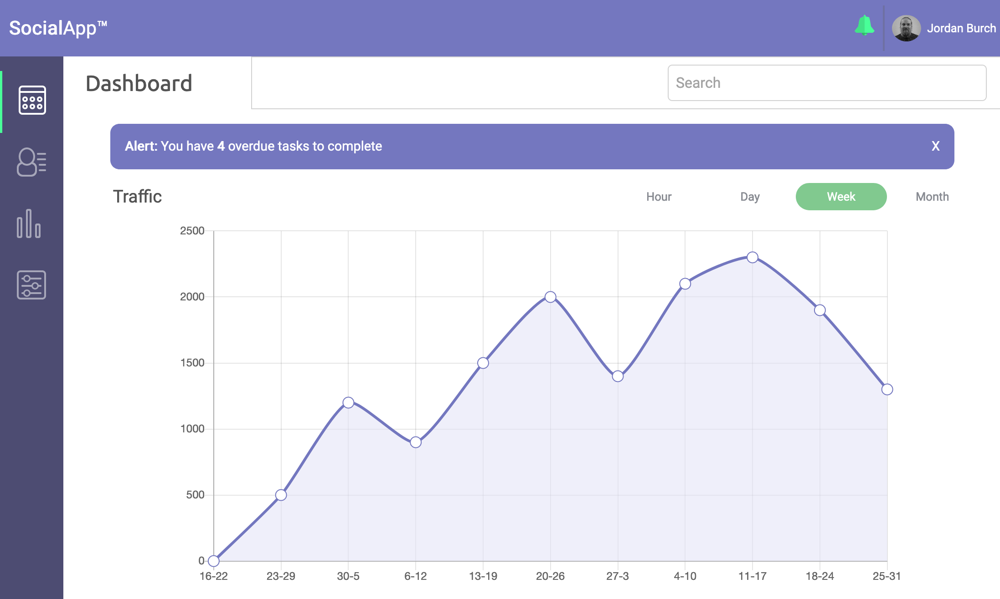
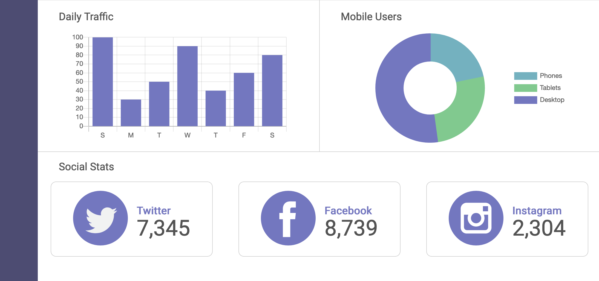
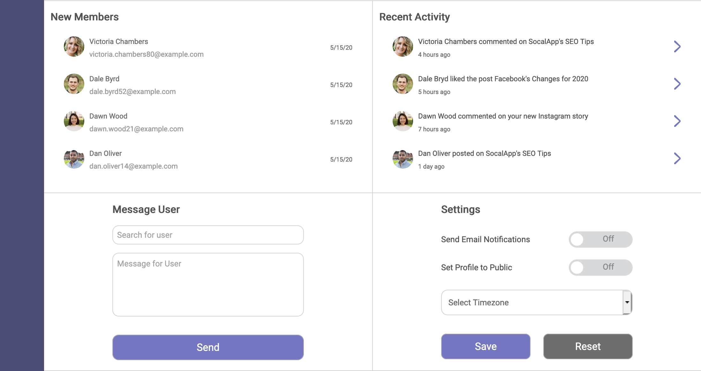

# Teachdegree-project 7
> An interactive Web Dashboard complete with JavaScript-driven charts and graphs. It features use of local storage, pop up notifcations and auto complete search features.

## Table of contents
* [General info](#general-info)
* [Screenshots](#screenshots)
* [Technologies](#technologies)
* [Features](#features)
* [Contact](#contact)

## General info
This Web application uses JavaScript, CSS, and HTML to deliver an informative and responsive Dashboard that is mobile-first in design. It uses chart.js to deliver reactive charts & graphs that respond to different time settings.

It also uses JavaScript to display and alert banner that the user can dismiss along with a pop notification menu that the user can also toggle & delete notifications.

Towards the bottom of the page on the left side, there is a "message user" section where you can search for users and it will autofill registered users.

on the bottom right side of the app, there is a settings section where users can toggle different options and select which timezone they prefer. The settings are then stored to local storage and loaded again when the page is loaded. There is also a button to reset save settings.

## Screenshots

## Technologies
* JavaScript
* Chart.js
* CSS3
* HTML5

## Features
List of features ready and TODOs for future development
* Pop up notifications that can be toggled
* Alert Banner the user can dismiss
* Responsive charts and graphs 
* Ability to change the data displayed on the main chart with a toggle
* Message user section with working autocomplete
* Settings saved to local storage

To-do list:
* Refractor JS to be more object-oriented
* Refractor SCSS to be more concise

## Contact
Created by [@JordanBurch101](https://github.com/Jordanburch101) - feel free to contact me!